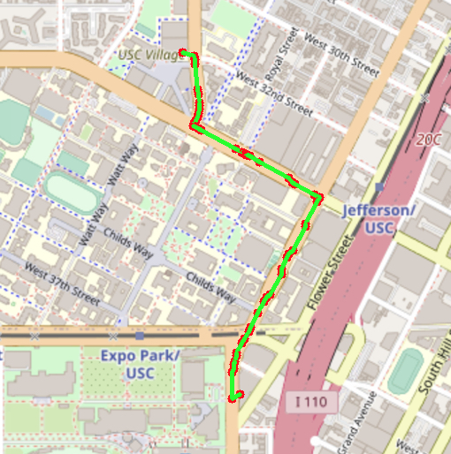

# EE599 Final Project - TrojanMap

Student: Nathan Peura
Video Link: https://youtu.be/jkNPqro5HRs

## TrojanMap

This is the final project for EE599, this assignment explores the use of graph algorithms with various points near the USC campus. These points are stored as nodes, and they contain information that contain the ID, latitude and longitude, location name, and neighbors. The specific node class can be seen below. 

> Important testing note under the bellman-ford algorithm handle in the CalculateShortestPath section

### The Node data Structure

Each point on the map is represented by the class **Node** shown below and defined in [trojanmap.h](src/lib/trojanmap.h).

```cpp
class Node {
  public:
    std::string id; // A unique id assign to each point
    double lat;     // Latitude
    double lon;     // Longitude
    std::string name; // Name of the location. E.g. "Bank of America".
    std::vector<std::string> neighbors; // List of the ids of all neighbor points.
};
```

The ID is unique for each location and is used to specify a specific location. The lat and lon are used to determine the distance between two nodes using the haversine formula, and these are the "edges" between the nodes used for shortest path and traveling salesman problem. The name is used for specifying locations for auto complete, get position, and shortest path algorithms. Lastly, the neighbors list is used to traverse between nodes with graph algorithms. 

### Implemented Functions

This section explains each function briefly before going into depth in the next section

**autoComplete:** This function takes an input prefix as a string and outputs a vector of node names as strings that match the input, it is case insensitive.

**getPosition:** This function takes an input name as a string and outputs the lat and lon of the corresponding location, returns (-1,-1) if no match.

**calculateShortestPath:** This function takes two input names, source and destination, and calculates the shortest path between the two locations. The returned path consists of a vector of node IDs, and returns empty if no match.

**travelingTrojan:** This function takes a list of location IDs as the input and determines the sequence that each node should be visited, which is returned as a vector of location IDs. This returned sequence is the minimum path to visit each of the nodes. 

---

## Functions Implemented

This section details the functions that were implemented in this project, their solution architecture, and examples.

### Autocomplete

```c++
std::vector<std::string> Autocomplete(std::string name);
```

Input: A string name, is a partial name to return the matching node names 

Output: A vector of strings that contains the matching node names 

**Code diagram:**

<p align="center"></p>


#### Time complexity

The time complexity of this function is: O(n)

This is the time complexity because every node is visited to check if their name matches O(n), and the insert to the output vector is O(1), therefore the time complexity of this function is O(n). 

#### Discussion

This problem gave insight into how some autocomplete functions work at popular search engines such as google, and how to manipulate strings to determine if there are matches with the node names, as well as learning to traverse the node lists. 

#### Examples

Not case sensitive: 

> Input: "ta"

<p align="center"></p>


> Input: "TA"

<p align="center"></p>


> Input: "c"

<p align="center"></p>


### GetPosition

```c++
std::pair<double, double> TrojanMap::GetPosition(std::string name)
```

Input: A string name, is the node name to find the lat and lon within the nodes 

Output: A pair of doubles containing the lat and lon of the matching node

**Code diagram:**

<p align="center"></p>


#### Time complexity

The time complexity of this function is: O(n)

This is the time complexity because every node is visited to check if their name matches O(n), and if a match the program returns the lat and lon but worst case there is no match so every node must be visited. 

#### Discussion

This problem gave insights into traversing the node lists and finding matching nodes, it was an important to visit every single node to ensure that we check that every node was visited to compare the names of the input. 

#### Examples

>Input: "Chipotle Mexican Grill"

<p align="center"></p>
<p align="center"></p>


>Input: "Target"

<p align="center"></p>
<p align="center"></p>

Case sensitive

>Input: "target"

<p align="center"></p>


### CalculateShortestPath

**Dijkstra**
```c++
std::vector<std::string> TrojanMap::CalculateShortestPath(std::string location1_name, std::string location2_name)
```
**Bellman-Ford**
```c++
std::vector<std::string> TrojanMap::CalculateShortestPath_bellmanFord(std::string location1_name, std::string location2_name)
```
> IMPORTANT NOTE: The bellman ford algorithm takes a long time to execute so the student unit tests are commented out for it (cause a timeout if not specified), note that the function passes the unit tests that I created and if you test it, it will take a while to finish

Input: location1_name is source node name, location2_name is destination node name

Output: A vector of node IDs that specify the shortest path from location1 to location2, outputs empty if not reachable


**Code diagram:**

>Dijkstra

<p align="center"></p>

> Bellman ford

Bellman ford algorithm worked by incrementing the shortest path by 1 until maximum n-1 away, this caused for longer execution times but allows the flexibility of potentially having negative edges and cycles (not necessarily applicable in this mapping case since edges are always greater than 0 unless back to itself).

#### Time complexity

**Dijkstra**

To go through the complexity of the function, I will show code snippets, the resulting time complexity is at the end of this subsection.

```c++
auto it = data.begin();
  for (int i = 0; i < data.size(); i++)
  {
    IDnode[it->first] = i;
    nodeID[i] = it->first;
    it++;
  }
```
> This for loop runs **n** times and inserts the mapping into two maps which are unordered so both **O(1)** to insert, so this snippet is O(n)

```c++
for (size_t i = 0; i < data.size(); i++)
  {
    weight_[i][i] = 0;
    for (auto n : data[nodeID[i]].neighbors)
    {
      weight_[i][IDnode[n]] = CalculateDistance(data[nodeID[i]], data[n]);
      weight_[IDnode[n]][i] = weight_[i][IDnode[n]];
    }
  }
```
> Within createWeights(), this for loop runs **n** times and visits each neighbor of the specific node to populate the adj matrix, therefore the two for loops are worst case O(n^2), the lookups for the mapping in the nodeID map and those are constant time, so the real time complexity is O(n^2) for this

```c++
while (visited.size() < weight_.size() && !unreach && visited.count(IDnode[ID2]) == 0)
  {
    unreach = true;
    int u = FindMinInDButNotInVisited(d, visited, unreach);
    visited.insert(u);

    for (int i = 0; i < weight_.size() && !unreach; i++)
    {
      if (d[i] > d[u] + weight_[u][i])
      { //didnt use std min because want to set parent
        d[i] = d[u] + weight_[u][i];
        parent[i] = u;
      }
    }
  }
```

> Next is the actual dijkstra's algorithm, which visits each node (if it is reachable) and terminates when the destination ndoe is found. This algorithm visits each node from the while loop, and has a nested for loop that also visits each node in the weight_ matrix, therefore the time complexity is O(n^2)

The maximum time complexity is O(n^2) for this function so therefore:

Function time complexity: **O(n^2)**


**Bellman-Ford**

This function is similar to the dijkstra's function where it has the same function as createWeights() which runs O(n^2) time, the different code segment is:

```c++
for(int i = 0; i < weight_.size()-1; i++) {
    for(int u = 0; u < weight_.size(); u++) {
      for(int v = 0; v < weight_.size(); v++) {
        if(d[v] > d[u] + weight_[u][v]) {
          d[v] = d[u] + weight_[u][v];
          parent[v] = u;
        }
      }
    }
    std::cout << i << std::endl;
}
```

The time complexity for this function is: O(n*m), where n is the number of nodes and m is the number of edges, the first loop runs n-1 times and the subsequent two nodes run for the number of edges times, so therefore this is O(n*m). 

The final time complexity of this function is **O(n*m)**


#### Discussion

This problem gave insight into shortest path algorithms and applying dijkstra's algorithm to achieve the shortest path between the two locations. In this application, dijkstra's algorithm worked because every edge is greater than one and therefore there are no negative edges or negative cycles. Plus, dijkstras algorithm finds the shortest path from one node to every other node, so it is able to find the path from the source to the destination. 

It also gave insight into applying another shortest path algorithm - bellman-ford. It was interesting how different the execution times between the two were, dijkstra's algorithm finished very quickly: (ms), whereas bellman-ford took: (ms), it is likely due to the significantly larger number of edges compared to the nodes, so the time complexity of bellman-ford overtook the time complexity of dijkstras. Plus, bellman-ford was not very helpful in this situation due to no negative edges or negative cycles, where it beats dijkstra's. 

#### Examples

>Input: "Target", "ChickfilA"

<p align="center"></p>
<p align="center"></p>

Note that there is a quicker walk shown on google maps but our dataset does not include those node locations. 

>Input: "Ralphs", "ChickfilA"

<p align="center"></p>


### TravellingTrojan

**Brute force**

```c++
std::pair<double, std::vector<std::vector<std::string>>> TrojanMap::TravellingTrojan(std::vector<std::string> &location_ids)
```

**2-Opt**

```c++
std::pair<double, std::vector<std::vector<std::string>>> TrojanMap::TravellingTrojan_2opt(std::vector<std::string> &location_ids)
```

Input: A vector of location_ids that specify each location to be visited

Output: A pair of double and vector of vectors, the double specifies the shortest path length, the vector of vectors show the sequence of paths used to find the shortest path, with the last element in the vector being the shortest path sequence to visit each location

**Brute force code diagram**

<p align="center"></p>

**2-Opt code diagram**

<p align="center"></p>


#### Time complexity

##### Brute force

To go through the time complexity I will show code snippets, the final complexity is seen at the end of this subsection.

**Snippet 1**

```c++
for (int i = 0; i < location_ids.size(); i++)
  {
    IDnode[location_ids[i]] = i;
    nodeID[i] = location_ids[i];
    it++;
  }

  for (size_t i = 0; i < location_ids.size(); i++)
  { //calc distance between all of the nodes
    weight_TS[i][i] = 0;
    for (size_t j = 0; j < location_ids.size(); j++)
    {
      weight_TS[i][j] = CalculateDistance(data[nodeID[i]], data[nodeID[j]]);
    }
  }
```

**This code only runs the first time the program is created, every subsequent run does not run this since it generates the data needed for traveling trojan**

> The first for loop creates the mapping from element number to node ID # and visa versa, the for loop will run **n** times and the insert and lookup of the maps will be log(n) time, so this for loop runs O(nlogn) time.

> The second for loop goes through every node in the input vector - n times. Within this, every other location node distance is calculated, therefore it runs O(n^2) 

**Snippet 2**

```c++
if (curResult.size() == nums.size())
  {
    result.push_back(curResult);
    return;
  }
for (int i = 1; i < nums.size(); i++)
  {
    if (find(curResult.begin(), curResult.end(), nodeID[i]) != curResult.end())
    {
      continue;
    }
    std::vector<std::string> nextCurResult = curResult;
    if(nextCurResult.size() == 0) {
      nextCurResult.push_back(nodeID[0]);
    }
    nextCurResult.push_back(nodeID[i]);
    PermuteCombs(nums, result, nextCurResult);
  }
```

> This snippet creates the permutations for every combination of the location IDs, the for loop runs n-1 times and the "find" is used to determine if the element is already in the current vector, this whole function runs (n-1)! time to generate these permutations, this is due to the input not including the starting node which will always be the first element of the location_ids, also the lookup to the unordered_map is O(1). Later, the starting node is added to the end of the path as well.

**O((n-1)!)**


**Snippet 3**

```c++
for (auto n : permutes)
  {
      std::vector<std::string> idPermutes = n;
      idPermutes.push_back(n[0]);
      double pathLen = CalculatePathLength(idPermutes);
      if (pathLen < pathMin)
      {
        pathMin = pathLen;
        indexMin = index;
      }
      paths.push_back(idPermutes);
      index++;
  }
```

> Last, this is where the path distance of each permutation is calculated, the permutation size is (n-1)! vectors, and the CalculatePathLength function runs O(n-1) -> O(n), so the time complexity of this for loop is O((n-1)! * n).

Thus, the time complexity of this function is **O(n*(n-1)!)** due to the code snippet 3 


##### 2-Opt

2-opt has the same **Snippet 1** as brute force, which is O(n^2)

**Snippet 2**

```c++
for (int i = 0; i < location_ids.size(); i++)
  {
    nodesLoc.push_back(i);
  }
nodesLoc.push_back(0); //return to the beginning

bool improve = true;

std::vector<std::string> nodesIDsPath;
std::vector<std::vector<std::string>> paths;

for (auto n : nodesLoc) {
  nodesIDsPath.push_back(nodeID[n]);
}
```

> The first two for loops run n times to create an initial path vector and the unordered_map lookup is constant time -> O(n)

**Snippet 3**

```c++
while (improve)
  {
    improve = false;
    std::vector<int> newNodesVec;
    std::vector<int> bestLen2OP;
    std::vector<std::string> newIDsVec;

    for (int i = 1; i < location_ids.size() - 1; i++)
    {
      for (int k = i+1; k < location_ids.size(); k++)
      {
        if(k == i) continue;
        twoOptSwap(i, k, nodesLoc, newNodesVec);
        for (auto n : newNodesVec) {
          newIDsVec.push_back(nodeID[n]);
        }
        paths.push_back(newIDsVec);
        
        double currLen = CalculatePathLength(newIDsVec);
        if(currLen < bestLen) {
          improve = true;
          bestLen2OP = newNodesVec;
          bestLen = currLen;
          minIndex = index;
        }
        newIDsVec.clear();
        newNodesVec.clear();
        index++;
      }
    }
    nodesLoc = bestLen2OP;
  }
```

> 2-Opt is a heuristic function that sometimes does not find the absolute maximum, but is faster than brute force, this while loop continues to run the switching until no improvement is found, within the while loop the first for loop runs n-1 times and the next for loop runs FILL, and every loop the twoOptSwap is ran, which reorders the vector and takes O(n) time, therefore the time complexity of this is O(n^2) FILL

The time complexity of the 2-Opt implementation is **O(n^2)** due to the snippet 3. 

#### Discussion

This problem gave insight into the traveling salesman problem and implementing a brute force solution and a 2-opt heurisitc. It was interesting how the 2-opt heuristic was able to significantly speed up the execution time and calculate a good (but not guarenteed minimum) shortest path. This difference made me think about different applications that are or could use a heuristic rather than a solution that finds the absolute answer / minimum. Ultimately this problem was very important to learn! 

#### Examples

Input: 6 locations

> Brute force

<p align="center"></p>

Final:
<p align="center"></p>


> 2-Opt 

<p align="center"></p>

Final:
<p align="center"></p>

---

## Conclusion

This project taught essential algorithms that are important for interviews and more advanced CS problems. The first problem taught traversing the data vector and matching a string prefix to each name. The second problem was similar to the first where the data vector was traversed and the name was compared. The third problem taught shortest path algorithms where you start with a source and perform a shortest path algorithm to calculate the shortest path between the two points, I used dijkstra's alg in this implementation. The fourth problem was a traveling salesman problem where two functions were implemented, brute force took significantly longer than the 2-opt function, however, the 2-opt function is a heuristic and doesn't always find the absolute shortest path. 

## Lessons Learned

- Traversing graphs with shortest path algorithms are approachable and can be seen with many popular applications such as google maps
- Heuristics are significantly quicker in execution times and can be good enough for most applications
- Commit often so progress is saved and you can revert if mess up anything


---

The following describes the prerequisites, running the program, and testing the program. 

## Prerequisites

### OpenCV Installation

For visualizations we use OpenCV library. You will use this library as a black box and don't need to worry about the graphic details.

**Notice**: Installing this library may take a long time. This is only for visualization. You can still start coding even without installing this library and visualization.

Use the following commands to install OpenCV.

```shell
cd TrojanMap
git clone https://github.com/opencv/opencv.git
cd opencv/
mkdir build install
cd build
```

For Ubuntu,
```shell
sudo apt-get install cmake libgtk2.0-dev pkg-config
sudo apt install libcanberra-gtk-module libcanberra-gtk3-module
```

For MacOS,
```shell
brew install cmake
```

Next, type the following, but make sure that you set the **path_to_install_folder** to be the absolute path to the install folder under opencv.

```shell
cmake -D CMAKE_INSTALL_PREFIX=**path_to_install_folder** -D BUILD_LIST=core,highgui,imgcodecs,imgproc,videoio  -D WITH_TBB=ON -D WITH_OPENMP=ON -D WITH_IPP=ON -D CMAKE_BUILD_TYPE=RELEASE -D BUILD_EXAMPLES=OFF -D WITH_NVCUVID=ON -D WITH_CUDA=ON -D BUILD_DOCS=OFF -D BUILD_PERF_TESTS=OFF -D BUILD_TESTS=OFF -D WITH_CSTRIPES=ON -D WITH_OPENCL=ON ..
make install
```

For example, if cloned this repo under "/Users/ari/github/TrojanMap", you should type:

```shell
cmake -D CMAKE_INSTALL_PREFIX=/Users/ari/github/TrojanMap/opencv/install  -D BUILD_LIST=core,highgui,imgcodecs,imgproc,videoio  -D WITH_TBB=ON -D WITH_OPENMP=ON -D WITH_IPP=ON -D CMAKE_BUILD_TYPE=RELEASE -D BUILD_EXAMPLES=OFF -D WITH_NVCUVID=ON -D WITH_CUDA=ON -D BUILD_DOCS=OFF -D BUILD_PERF_TESTS=OFF -D BUILD_TESTS=OFF -D WITH_CSTRIPES=ON -D WITH_OPENCL=ON ..
make install
```

---

## Run the program

Please run:

```shell
bazel run src/main:main
```

If everything is correct, this menu will show up.

```shell
**************************************************************
* Select the function you want to execute.
* 1. Autocomplete
* 2. Find the position
* 3. CalculateShortestPath
* 4. Traveling salesman problem
* 5. Exit
**************************************************************
```

Within #3, CalculateShortestPath there will be an option to choose dijkstra's or Bellman-ford, bellman-ford will run a lot slower but still get the same output as dijkstra's

Within #4, TSP there will be an option to choose brute force or 2opt method, 2 opt will find the path a lot quicker with large N, but small n both will find in similar time. 

## Test the program

Already created tests:
```shell
bazel test tests:tests:trojanmap_test
```

Student tests: 

```shell
bazel test tests:trojanmap_test_student
```


Thank you!